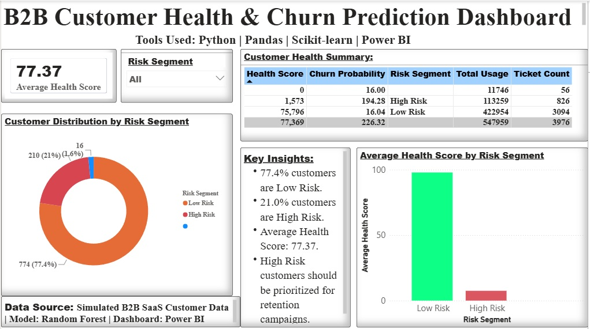

# B2B Customer Health & Churn Prediction Dashboard

## Overview
An AI-powered B2B SaaS customer churn prediction and health scoring project built using Python, Pandas, Scikit-learn, and Power BI.

## Tools Used
• Python
• Pandas
• Scikit-learn
• Power BI

## Dashboard Features
• Average Customer Health Score KPI
• Customer Distribution by Risk Segment
• Customer Health Summary Table
• Interactive Risk Segment Filter
• Key Business Insights
• Average Health Score by Risk Segment

## Key Insights
• 77.4% customers are Low Risk
• 21.0% customers are High Risk
• Average Health Score: 77.37
• High Risk customers should be prioritized for retention campaigns

## Files Included
- b2b_customer_churn_prediction.py
- customer_health_scores.csv
- feature_importance.png
- B2B Customer Health & Churn Prediction Dashboard.pbix
